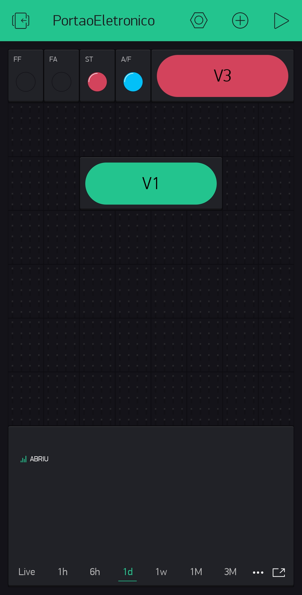
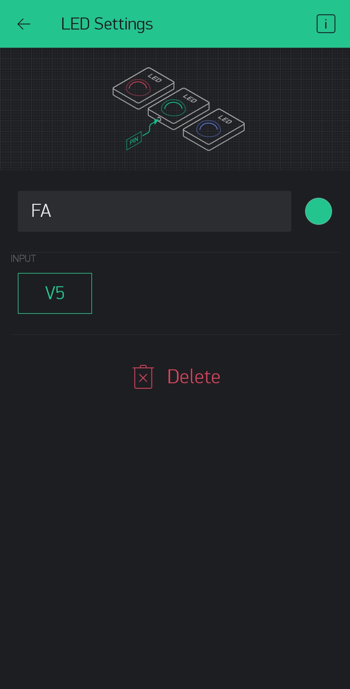
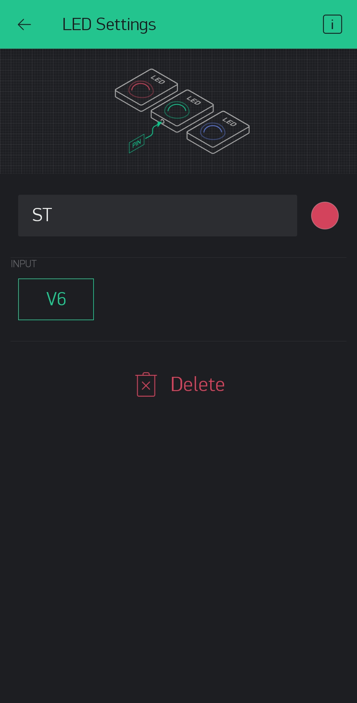
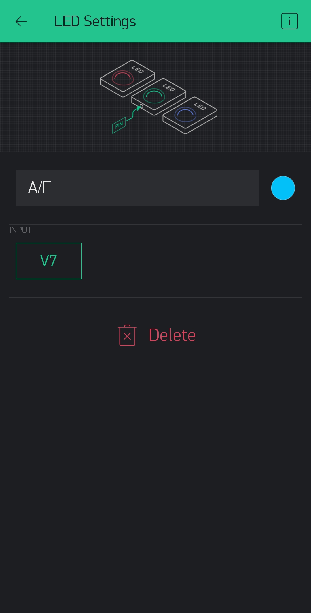
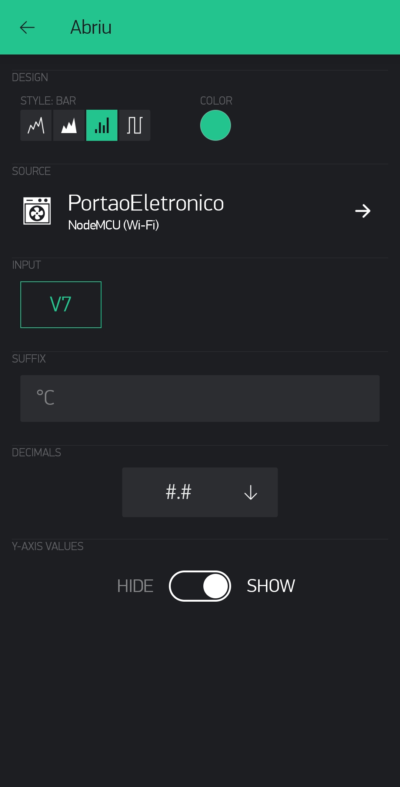
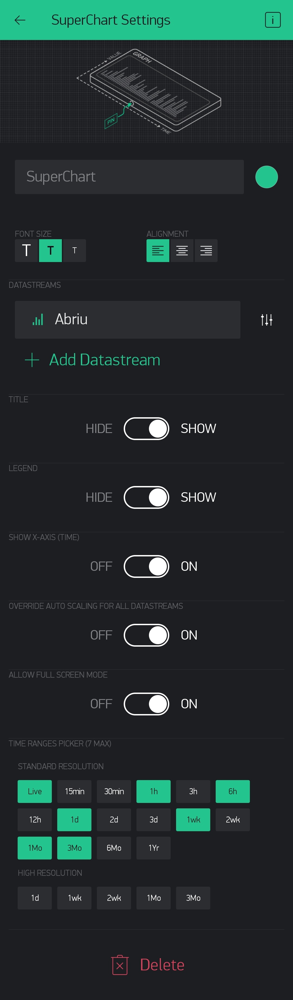
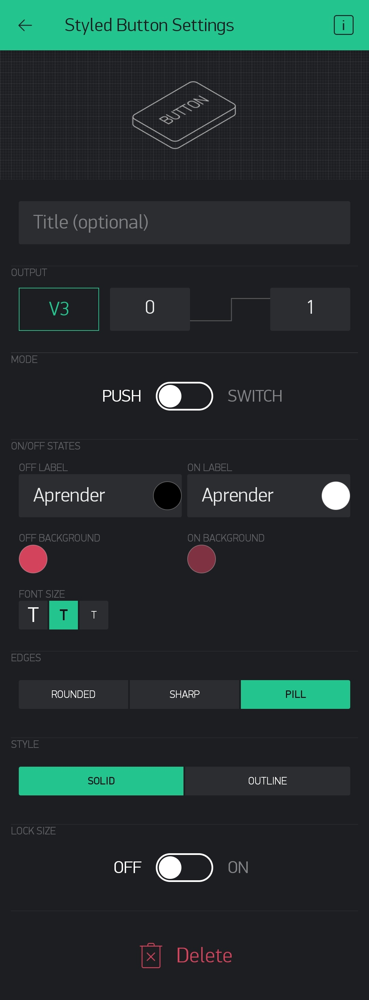
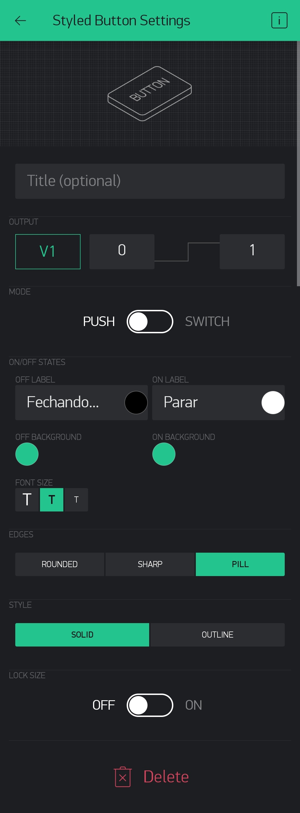

# Portão eletrônico com ESP8266

Esse software foi criado para atender a internet das coisas aplicada em um portão eletrônico, nesse caso o modelo da placa mãe foi a "ROSSI KX30FS V1.2-14".

Para mais detalhes veja em meu canal do 

## Tecnologia usada

Nesse projeto foi utilizado a IDE PlatformIO onde pode ser consultado todas a documentação clicando [Aqui](https://platformio.org/platformio-ide) e também o Blynk que tem uma ótima documentação nesse site [Aqui](https://docs.blynk.cc/#intro)

## Como usar

Logo abaixo tem o esquema de ligações entre o arduino e a placa ROSSI.

Agora vem as configuraçõe da parte do Blynk.

